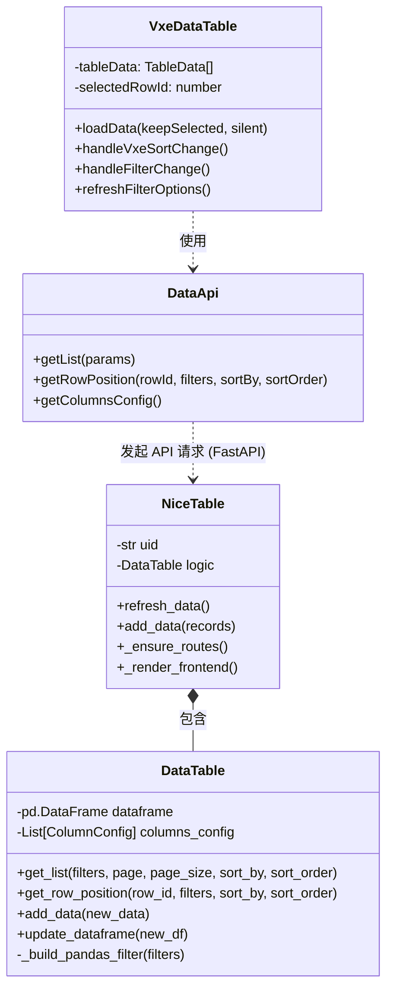
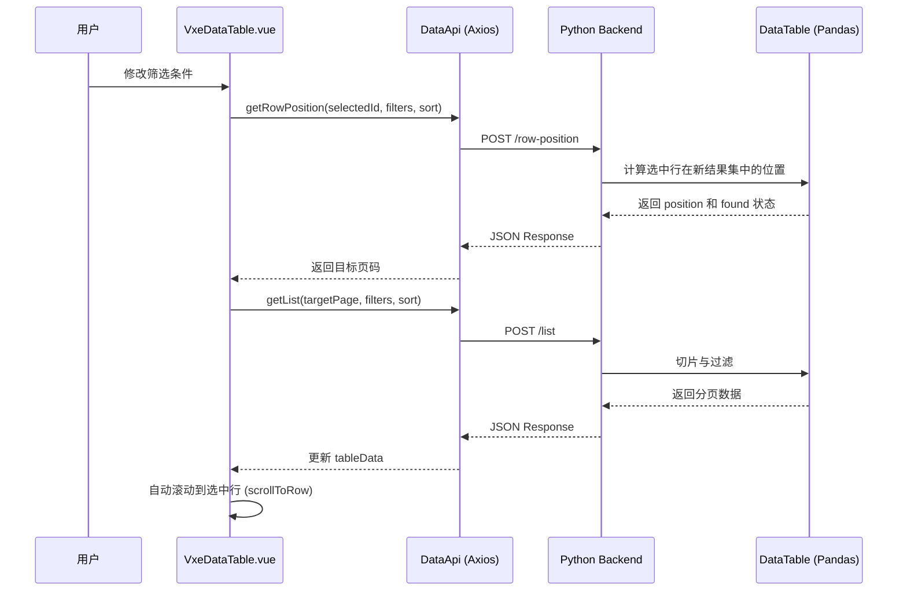
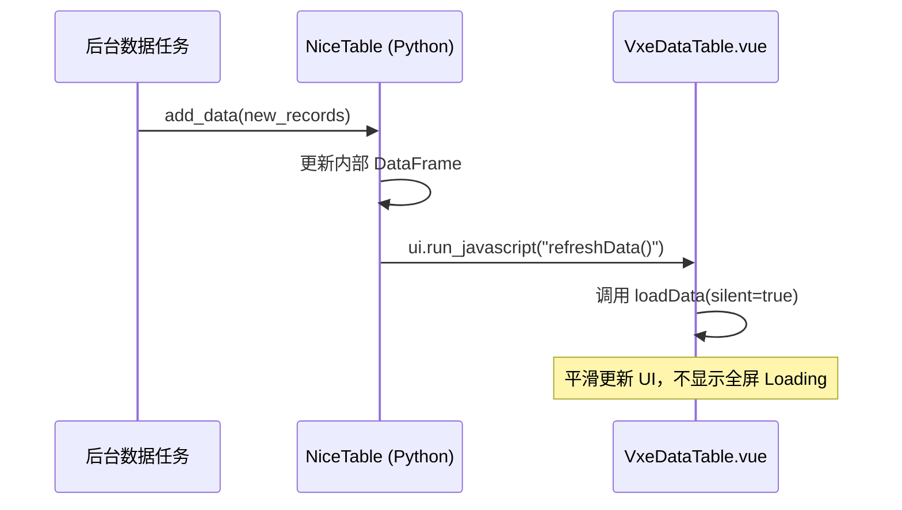

# 大数据量表格系统 (High Performance Table System)

一个基于 Python + Vue 3 的高性能大数据量表格展示系统。该系统集成了 **NiceGUI**、**FastAPI** 和 **VXETable**，专为处理数十万级数据的流畅展示、实时刷新及复杂筛选而设计。

## 核心特性

### 1. 双方案对比架构
- **VXETable (推荐)**：针对 500+ 行数据的极速虚拟滚动方案，支持毫秒级页面响应。
- **Element Plus Table**：传统表格展示方案，适用于中小规模数据集。
- **动态切换**：支持在前端实时切换渲染引擎，方便进行性能和视觉对比。

### 2. 极致性能优化
- **虚拟滚动**：VXETable 方案原生支持虚拟 DOM 渲染，即使展示 2000+ 行/页也能保持 60fps 的滚动体验。
- **并行刷新**：数据加载与列筛选选项同步并行获取，显著降低网络等待延迟。
- **节流更新**：针对实时流数据，对列头筛选下拉列表进行智能节流（2秒/次），平衡实时性与 CPU 占用。
- **轻量级组件**：在 VXETable 中使用原生 CSS 标签替代重量级 UI 组件，极大提升渲染效率。

### 3. 深度 NiceGUI 集成
- **原生 Python 控制**：通过 `NiceTable` 类轻松将 Vue 表格嵌入 NiceGUI 应用。
- **实时数据流**：支持 `add_data()` 增量更新，后端数据变化可实时推送到前端展示。
- **跨实例隔离**：基于 `x-table-id` 的多实例管理架构，支持在同一页面运行多个独立的表格控件。

### 4. 增强的交互体验
- **列设置 (Native VXE Customization)**：
  - 点击“列设置”按钮可打开原生面板。
  - 支持 **拖拽调整列顺序**。
  - 支持 **列显示/隐藏** 切换。
  - 自动持久化：列顺序和可见性设置自动保存至浏览器 Storage。
- **行选中保持**：
  - 筛选/排序变更后，系统自动定位并 **滚动到选中行**。
  - 采用“立即+延迟”的双重滚动算法，确保在虚拟滚动场景下精确定位。
- **多功能筛选**：
  - 支持文本、数字、多选、日期等多种类型。
  - **16进制支持**：数字列支持直接输入 `0x123` 进行筛选。
  - **流式追踪**：开启“自动添加”时，支持自动跳转到最后一页追踪最新数据。

## 系统架构

### 1. 类图 (Class Diagram)



### 2. 交互流程图 (Sequence Diagram)

#### 筛选与自动定位流程


#### 实时数据推送流程


## 技术栈

- **前端**: Vue 3, TypeScript, VXETable, Element Plus, Vite
- **后端**: Python 3.8+, NiceGUI, FastAPI, Pandas, Pydantic

## 项目结构

```text
bigdata_from_plan/
├── data_table.py           # 核心数据管理逻辑 (Pandas 驱动)
├── nice_table.py           # NiceGUI 封装组件
├── nicegui_empty_table.py  # 主演示入口 (包含自动添加模拟)
├── data_generator.py       # 随机数据生成器
├── front_vue/              # Vue 3 前端源码
│   ├── components/
│   │   ├── DataTable.vue    # Element Plus 表格组件
│   │   └── VxeDataTable.vue # VXETable 高性能组件
│   ├── App.vue             # 根组件 (含版本切换逻辑)
│   └── main.ts             # 入口配置 (VXETable 注册)
├── requirements.txt        # Python 依赖
└── package.json            # 前端依赖
```

## 安装与运行

### 1. 环境准备
确保已安装 Python 3.8+ 和 Node.js 16+。

### 2. 构建前端
首次运行或修改前端代码后，需重新构建产物：
```bash
npm install
npm run build
```

### 3. 安装后端依赖
```bash
pip install -r requirements.txt
```

### 4. 启动演示
```bash
python nicegui_empty_table.py
```
访问 `http://localhost:8081` 即可看到演示界面。

## API 说明

### 筛选参数 (FilterParams)
系统支持高度灵活的动态筛选：
- **文本列**: 支持模糊匹配。
- **数字列**: 
  - `operator`: `=`, `>`, `<`, `>=`, `<=`。
  - `value`: 支持数字或 `0x` 前缀的字符串。
- **多选列**: 支持传入数组进行 `IN` 匹配。

### 核心方法
- `refresh_data()`: 通知前端重新从后端获取最新数据。
- `add_data(records)`: 向 DataFrame 增量追加数据。
- `update_source(df)`: 替换整个数据源。

## 注意事项
- **VXETable 免费版**: 本项目使用 VXETable 免费版本，已能满足大部分高性能需求。
- **虚拟滚动限制**: 在 VXETable 下，所有行的高度必须一致以确保滚动条计算准确。

## 许可证
MIT License
