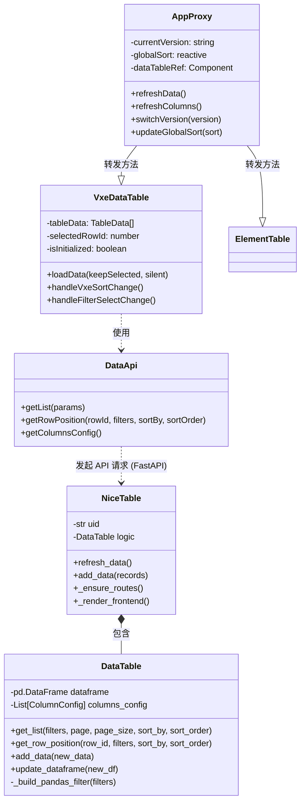
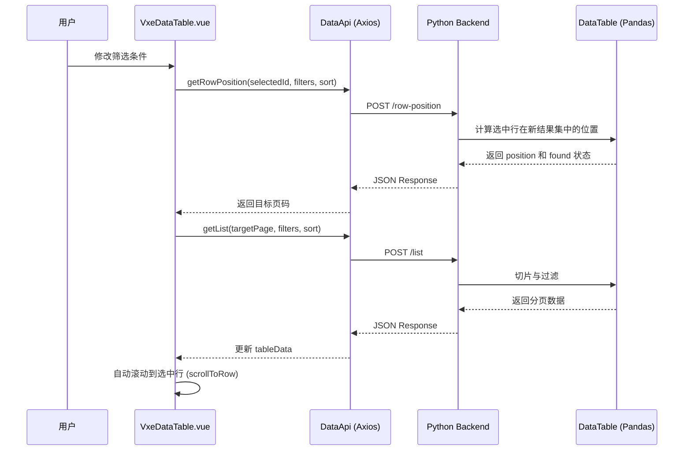
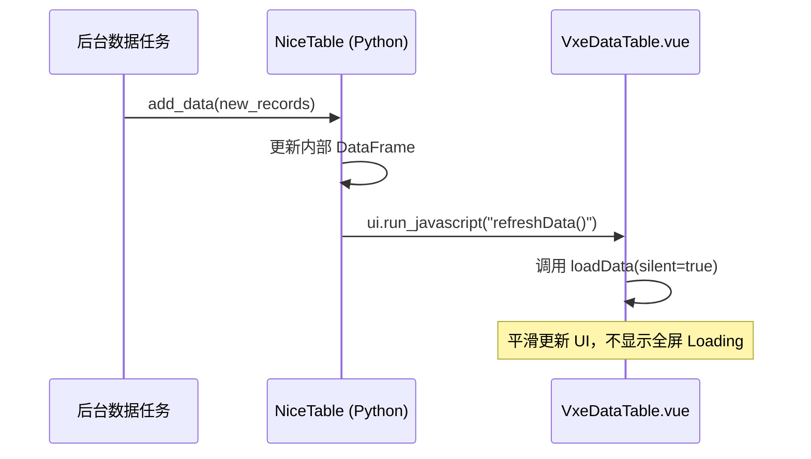

# 大数据量表格系统 (High Performance Table System)

一个基于 Python + Vue 3 的高性能大数据量表格展示系统。该系统集成了 **NiceGUI**、**FastAPI** 和 **VXETable**，专为处理数十万级数据的流畅展示、实时刷新及复杂筛选而设计。

## 核心特性

### 1. 双方案对比架构
- **VXETable (推荐)**：针对 500+ 行数据的极速虚拟滚动方案，支持毫秒级页面响应。
- **Element Plus Table**：传统表格展示方案，适用于中小规模数据集。
- **后端动态切换**：支持在 Python 端实时切换渲染引擎（VXETable vs Element Plus），方便进行性能对比和视觉评估。

### 2. 极致性能优化
- **虚拟滚动**：VXETable 方案原生支持虚拟 DOM 渲染，即使展示 2000+ 行/页也能保持 60fps 的滚动体验。
- **并行刷新**：数据加载与列筛选选项同步并行获取，显著降低网络等待延迟。
- **节流更新**：针对实时流数据，对列头筛选下拉列表进行智能节流（2秒/次），并根据数据增量（>=5%）智能触发后端选项重新计算。
- **轻量级组件**：在 VXETable 中使用原生 CSS 标签替代重量级 UI 组件，极大提升渲染效率。

### 3. 深度 NiceGUI 集成
- **原生 Python 控制**：通过 `NiceTable` 类轻松将 Vue 表格嵌入 NiceGUI 应用。
- **中央注册机制**：采用 `App.vue` 统一管理多实例注册与方法转发，确保在引擎切换时 API 通信不中断。
- **实时数据流**：支持 `add_data()` 增量更新，后端数据变化可实时推送到前端展示。
- **跨实例隔离**：基于 `x-table-id` 的多实例管理架构，支持在同一页面运行多个独立的表格控件。

### 4. 增强的交互体验
- **紧凑型 UI 设计**：全站采用 `mini` / `small` 尺寸，优化行高与间距，提升信息密度。
- **分页增强**：采用 `1+3+1` 精简分页布局，支持指针悬停的页码快速跳转。
- **即时筛选 (Instant Filtering)**：
  - **列表类筛选 (Select/Multi-select)**：选择选项后数据立即刷新，无需点击确认按钮。
  - **多选持久化**：多选时面板保持开启，方便连续勾选；单选时自动确认并收起。
- **列设置 (Native VXE Customization)**：
  - VXETable 方案通过原生面板支持 **拖拽排序** 和 **显隐切换**。
  - 设置自动同步，禁用本地存储以确保后端配置为准（可选）。
- **行选中保持**：
  - 筛选/排序/版本切换后，系统自动定位并 **滚动到选中行**。
  - 采用“立即+延迟”的双重滚动算法，确保在虚拟滚动场景下精确定位。
- **多功能筛选**：
  - 支持文本、数字、多选、日期等多种类型。
  - **数值类多选**：支持将数值列（如状态码、档位）配置为列表多选模式。
  - **16进制支持**：数字列支持直接输入 `0x123` 进行筛选。
  - **详情展示优化**：展开行详情时自动过滤 `_X_` 开头的内部保留键。

### 5. 健壮性与兼容性
- **渐进式加载**：引入骨架屏（Skeleton UI）和 `IntersectionObserver` 延迟渲染，解决隐藏 Tab 页中组件初始化失败的问题。
- **自动重试机制**：前端对 JS 模块加载及 Vue 实例注册进行自适应轮询（最长 60s），确保在复杂网络环境下稳定挂载。
- **缓存消除**：资源引用自动附加时间戳（`?v={ts}`），确保前端代码更新后立即生效。
- **MIME 类型修正**：后端自动注册 `.woff2` 等字体文件的 MIME 类型，消除浏览器控制台告警。
- **全局状态同步**：引入 `globalSort` 响应式状态，确保在切换表格引擎时排序状态无损迁移。

## 系统架构

### 1. 典型 UI 布局
系统提供了完整的 Quasar 后台管理界面布局：
- **Header**: 包含系统标题、Tab 切换（表格视图/统计分析）、个人信息。
- **Sidebar**: 提供菜单导航、表格引擎快速切换、模拟数据生成控制。
- **Main**: 采用 Flexbox 自动撑开，确保表格在不同屏幕尺寸下均能占据 100% 剩余高度。
- **Footer**: 展示系统状态、版本号及版权信息。

### 2. 类图 (Class Diagram)



### 2. 交互流程图 (Sequence Diagram)

#### 筛选与自动定位流程


#### 实时数据推送流程


## 技术栈

- **前端**: Vue 3, TypeScript, VXETable, Element Plus, Vite
- **后端**: Python 3.8+, NiceGUI, FastAPI, Pandas, Pydantic

## 项目结构

```text
bigdata_from_plan/
├── data_table.py           # 核心数据管理逻辑 (Pandas 驱动)
├── nice_table.py           # NiceGUI 封装组件
├── nicegui_empty_table.py  # 主演示入口 (包含自动添加模拟)
├── data_generator.py       # 随机数据生成器
├── front_vue/              # Vue 3 前端源码
│   ├── components/
│   │   ├── DataTable.vue    # Element Plus 表格组件
│   │   └── VxeDataTable.vue # VXETable 高性能组件
│   ├── App.vue             # 根组件 (含版本切换逻辑)
│   └── main.ts             # 入口配置 (VXETable 注册)
├── requirements.txt        # Python 依赖
└── package.json            # 前端依赖
```

## 安装与运行

### 1. 环境准备
确保已安装 Python 3.8+ 和 Node.js 16+。

### 2. 构建前端
首次运行或修改前端代码后，需重新构建产物：
```bash
npm install
npm run build
```

### 3. 安装后端依赖
```bash
pip install -r requirements.txt
```

### 4. 启动演示
```bash
python nicegui_empty_table.py
```
访问 `http://localhost:8081` 即可看到演示界面。

## API 说明

### 筛选参数 (FilterParams)
系统支持高度灵活的动态筛选：
- **文本列**: 支持模糊匹配。
- **数字列**: 
  - `operator`: `=`, `>`, `<`, `>=`, `<=`。
  - `value`: 支持数字或 `0x` 前缀的字符串。
- **多选列**: 支持传入数组进行 `IN` 匹配。

### 核心方法
- `refresh_data()`: 通知前端重新从后端获取最新数据。
- `add_data(records)`: 向 DataFrame 增量追加数据。
- `update_source(df)`: 替换整个数据源。

## NiceTable 接口文档

### 1. 构造函数 `NiceTable()`

| 参数 | 类型 | 默认值 | 说明 |
| :--- | :--- | :--- | :--- |
| `dataframe` | `pd.DataFrame` | **必填** | 表格的数据源 |
| `columns_config` | `List[ColumnConfig]` | `None` | 可选。如果不提供，将根据 DataFrame 自动推断 |
| `page_size` | `int` | `200` | 每页显示的默认行数 |
| `use_vxe` | `bool` | `False` | 是否默认使用 VXETable 引擎（建议设为 `True`） |

### 2. 公共方法

| 方法 | 说明 |
| :--- | :--- |
| `add_data(records: List[Dict], refresh: bool = False)` | 向表格追加一条或多条数据。`refresh=True` 时立即同步至前端。 |
| `update_source(dataframe: pd.DataFrame)` | 使用全新的 DataFrame 替换当前数据源，并通知前端重载。 |
| `switch_version(version: str)` | 切换渲染引擎。可选值为 `'vxe'` 或 `'element'`。 |
| `refresh_data()` | 显式触发前端刷新当前页的数据显示。 |
| `refresh_columns()` | 显式触发前端刷新列配置（如列标题、宽度等）。 |

### 3. 使用示例 (Quick Start)

```python
import pandas as pd
from nicegui import ui
from nice_table import NiceTable

# 1. 准备数据
df = pd.DataFrame([
    {'id': 1, 'name': 'Item A', 'price': 100.5},
    {'id': 2, 'name': 'Item B', 'price': 200.0},
])

@ui.page('/')
def main():
    # 2. 创建表格
    table = NiceTable(dataframe=df, use_vxe=True)
    
    # 3. 操作按钮
    with ui.row():
        ui.button('追加数据', on_click=lambda: table.add_data(
            [{'id': 3, 'name': 'New Item', 'price': 50.0}], 
            refresh=True
        ))
        ui.button('切到 Element', on_click=lambda: table.switch_version('element'))

ui.run(port=8081)
```

## 注意事项
- **高度继承**: 系统通过强力注入全局 CSS 确保了从 `html` 到 `NiceTable` 的全链路高度继承。若嵌入其他布局，需确保容器具备明确的高度。
- **VXETable 免费版**: 本项目使用 VXETable 免费版本，已能满足大部分高性能需求。
- **虚拟滚动限制**: 在 VXETable 下，所有行的高度必须一致以确保滚动条计算准确。

## 许可证
MIT License
