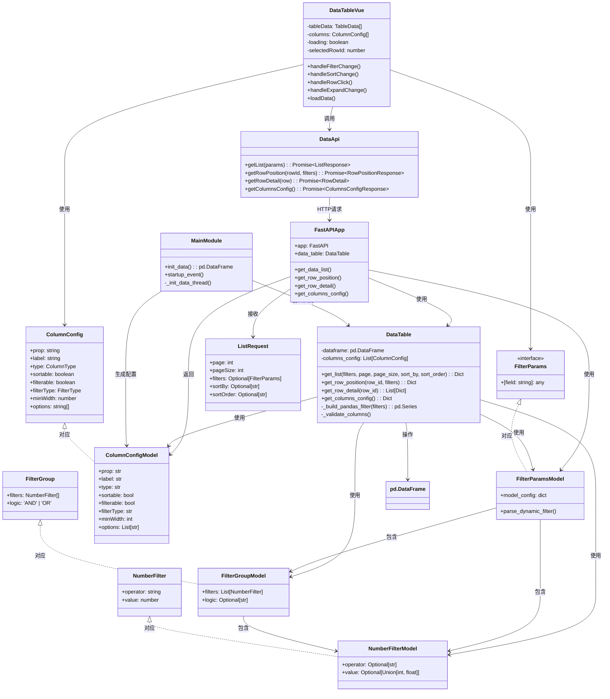
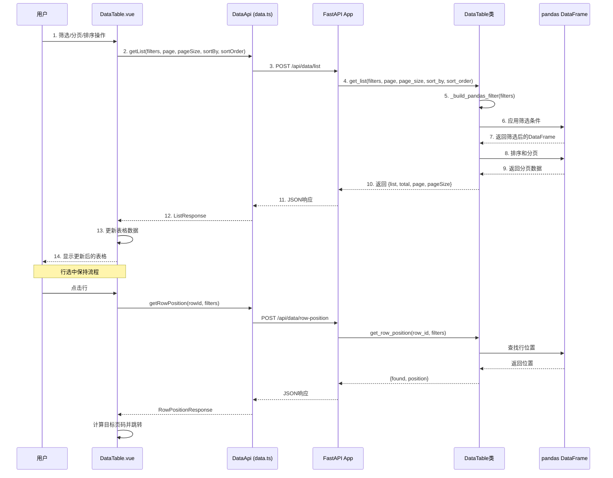
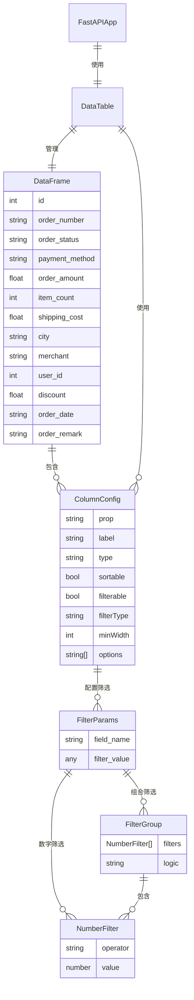

# 大数据量表格系统

一个基于 Python + Vue 3 的大数据量表格展示系统，支持 10 万条数据预生成和展示（架构支持千万级扩展）、全局筛选、行选中保持等功能。

## 技术栈

### 前端
- **Vue 3** - 渐进式 JavaScript 框架
- **TypeScript** - 类型安全的 JavaScript 超集
- **Element Plus** - Vue 3 组件库
- **Vite** - 快速的前端构建工具
- **Axios** - HTTP 客户端

### 后端
- **FastAPI** - 现代、快速的 Python Web 框架
- **Pandas** - 数据分析和处理库
- **NumPy** - 数值计算库
- **Pydantic** - 数据验证库

## 功能特性

### 1. 大数据量展示
- ✅ 支持 10 万条数据预生成和展示（架构支持千万级扩展）
- ✅ 服务端分页，每页 100 条数据（可调整：50/100/200/500）
- ✅ 虚拟滚动，流畅的滚动体验
- ✅ 显示筛选后的准确总数

### 2. 全局筛选功能
- ✅ **列头筛选**：所有列都支持在列头进行筛选
- ✅ **文本筛选**：订单号、城市、商家等文本字段支持模糊匹配
- ✅ **下拉筛选**：订单状态、支付方式等字段支持下拉选择
- ✅ **数字筛选**：ID、订单金额、商品数量、用户ID等支持操作符筛选
  - 支持 `=`, `>`, `<`, `>=`, `<=` 操作符
  - 支持多个条件组合（AND/OR 逻辑）
  - **支持16进制输入**：可以使用 `0x123` 格式输入16进制数字
  - 例如：订单金额 > 1000 AND < 5000，商品数量 >= 10 OR < 5
  - 例如：用户ID >= 0xFF（16进制格式）
- ✅ **日期筛选**：订单日期支持日期筛选
- ✅ **时间戳筛选**：ts字段支持灵活的文本匹配筛选
  - 支持日期格式：`2024-01-01`（筛选当天所有记录）
  - 支持时间格式：`12:30:45`（筛选所有该时间的记录）
  - 支持日期时间格式：`2024-01-01 12:30:45.123456`（精确匹配，包含微秒）
  - 支持部分匹配：可以只输入日期、时间或任意部分进行模糊匹配
- ✅ **Bytes类型字段**：payload等bytes类型字段支持文本筛选
  - 自动转换为16进制字符串显示（如：`FF 00 1A ...`）
  - 支持文本匹配筛选
- ✅ **筛选作用于全局**：筛选结果基于全部数据，不是当前页
- ✅ **重置筛选**：一键清除所有筛选条件

### 3. 行展开详情
- ✅ 点击行首的 `+` 号展开显示详细信息
- ✅ 每个字段单独一行显示，清晰易读

### 4. 行选中保持可见
- ✅ **行选中**：点击表格行可选中（蓝色高亮显示）
- ✅ **筛选保持**：筛选条件变更时，自动跳转到包含选中行的页面
- ✅ **自动滚动**：自动滚动到选中行，使其在可视区域中间显示
- ✅ **智能处理**：
  - 如果选中行不在筛选结果中，自动清除选中状态
  - 分页变化时不保持选中行（用户手动切换页面）
  - 每页数量变化时，如果选中了行，会保持选中行可见

### 5. 服务端排序
- ✅ **列头排序**：点击列头可进行升序/降序排序
- ✅ **服务端排序**：排序在服务端执行，支持大数据量排序
- ✅ **多列排序**：支持按不同字段排序（当前实现为单列排序）

### 6. 列管理
- ✅ **列设置**：支持显示/隐藏列
- ✅ **列固定**：支持固定左侧列（如ID列）
- ✅ **列宽调整**：支持手动调整列宽

### 7. 数据类型支持
- ✅ **字符串类型**：支持文本筛选和多选筛选
- ✅ **数字类型**：支持操作符筛选和16进制输入（如 `0x123`）
- ✅ **日期类型**：支持日期筛选
- ✅ **时间戳类型（ts）**：支持微秒精度，灵活的文本匹配筛选
  - 存储格式：float类型时间戳（微秒精度）
  - 显示格式：`YYYY-MM-DD HH:MM:SS.ffffff`（6位微秒）
  - 筛选支持：日期、时间、日期时间或任意部分匹配
- ✅ **Bytes类型**：自动转换为16进制字符串显示，支持文本筛选
  - 存储格式：Python bytes对象
  - 显示格式：16进制字符串（如：`FF 00 1A ...`）
  - 字段识别：自动识别字段名包含 `bytes`、`hex`、`payload` 等关键词的字段

## 项目结构

```
bigdata_from_plan/
├── backend/                 # 后端目录
│   ├── main.py             # FastAPI 主文件
│   ├── api.py              # API 路由定义
│   ├── data_table.py       # 数据处理类
│   └── requirements.txt     # Python 依赖
├── src/                     # 前端源码
│   ├── api/                # API 接口
│   │   └── data.ts        # 数据接口
│   ├── components/         # Vue 组件
│   │   └── DataTable.vue  # 数据表格组件
│   ├── types/              # TypeScript 类型定义
│   │   └── index.ts       # 类型定义
│   ├── App.vue            # 根组件
│   └── main.ts            # 入口文件
├── nicegui_vue_embed.py   # NiceGUI 集成入口
├── package.json            # 前端依赖配置
├── vite.config.ts         # Vite 配置
├── tsconfig.json          # TypeScript 配置
└── README.md              # 项目说明文档
```

## 系统架构与调用关系

### UML 类图

以下类图展示了前后端的主要组件及其调用关系：



### 调用流程图

以下流程图展示了数据获取的完整调用链：



### 数据模型关系图



## 安装和运行

### 前置要求
- Python 3.8+
- Node.js 16+
- npm 或 yarn

### 方式一：统一启动（推荐）

使用 `nicegui_vue_embed.py` 作为统一入口，同时启动后端和前端服务：

1. **构建前端应用**（首次运行或前端代码更新后）：
```bash
npm install
npm run build
```

2. **安装 Python 依赖**：
```bash
pip install -r backend/requirements.txt
```

3. **启动应用**：
```bash
python nicegui_vue_embed.py
```

应用将在以下地址启动：
- NiceGUI 主页: `http://localhost:8080/`
- 数据表格页面: `http://localhost:8080/data-table`
- FastAPI 后端: `http://localhost:3001`
- API 文档: `http://localhost:3001/docs`

### 方式二：分别启动（开发模式）

#### 后端设置

1. 进入后端目录：
```bash
cd backend
```

2. 安装 Python 依赖：
```bash
pip install -r requirements.txt
```

3. 启动后端服务：
```bash
python main.py
```

后端服务将在 `http://localhost:3001` 启动。

#### 前端设置

1. 安装依赖：
```bash
npm install
```

2. 启动开发服务器：
```bash
npm run dev
```

前端应用将在 `http://localhost:5173` 启动。

## 使用说明

### 1. 筛选数据

#### 文本筛选
- 在列头输入框中输入文本，支持模糊匹配
- 例如：在"订单号"列输入"ORD"，会筛选出所有订单号包含"ORD"的记录
- 例如：在"城市"列输入"北京"，会筛选出所有城市包含"北京"的记录

#### 数字筛选
- 选择操作符（=、>、<、>=、<=）
- 输入数值（支持十进制和16进制格式）
- **16进制输入**：可以使用 `0x` 前缀输入16进制数字
  - 例如：输入 `0x123` 会被解析为十进制 291
  - 例如：输入 `0xFF` 会被解析为十进制 255
  - 支持大小写：`0x123` 和 `0X123` 都可以
- 支持添加多个条件：
  - 点击"+ 添加条件"按钮
  - 选择逻辑关系（AND/OR）
  - 例如：订单金额 > 1000 AND < 5000 表示订单金额在 1000 到 5000 之间
  - 例如：商品数量 >= 10 OR < 5 表示商品数量大于等于10或小于5
  - 例如：用户ID >= 0x1000 AND < 0x2000（使用16进制）

#### 下拉筛选
- 在列头的下拉框中选择选项（支持多选）
- 例如：在"订单状态"列选择"已付款"、"已完成"，会筛选出所有状态为已付款或已完成的记录
- 例如：在"支付方式"列选择"支付宝"，会筛选出所有使用支付宝支付的记录

#### 时间戳筛选（ts字段）
- 支持灵活的文本匹配筛选
- **日期筛选**：输入 `2024-01-01` 会筛选出当天所有记录
- **时间筛选**：输入 `12:30:45` 会筛选出所有该时间的记录
- **日期时间筛选**：输入 `2024-01-01 12:30:45.123456` 会精确匹配（包含微秒）
- **部分匹配**：可以只输入任意部分进行模糊匹配
  - 例如：输入 `12:30` 会匹配所有 12:30 时分的记录
  - 例如：输入 `.123456` 会匹配所有包含该微秒的记录
- 时间戳精度：支持微秒级精度（6位微秒）

#### Bytes类型字段筛选
- payload等bytes类型字段会自动转换为16进制字符串显示
- 支持文本匹配筛选
- 例如：在payload字段输入 `FF 00` 会筛选出包含该字节序列的记录

### 2. 查看详情
- 点击行首的 `+` 号展开该行的详细信息
- 再次点击 `-` 号收起详情

### 3. 选中行
- 点击表格中的任意一行，该行会高亮显示（蓝色背景）
- 修改筛选条件后，系统会自动跳转到包含选中行的页面
- 自动滚动到选中行，使其在可视区域中间显示

### 4. 分页操作
- 使用底部的分页组件切换页面
- 可以调整每页显示的数量（50/100/200/500）
- 显示筛选后的总记录数和当前页信息

## API 接口

### 获取数据列表
```
POST /api/data/list
```

请求参数：
```json
{
  "page": 1,
  "pageSize": 100,
  "sortBy": "order_amount",
  "sortOrder": "descending",
  "filters": {
    "order_amount": {
      "operator": ">",
      "value": 1000
    },
    "user_id": {
      "operator": ">=",
      "value": "0x1000"
    },
    "order_status": ["已付款", "已完成"],
    "ts": "2024-01-01",
    "payload": "FF 00"
  }
}
```

**筛选值说明**：
- **数字筛选支持16进制格式**：`"value": "0x123"` 会被解析为十进制 291
- **时间戳筛选支持文本匹配**：`"ts": "12:30:45"` 会匹配所有该时间的记录
- **Bytes类型字段筛选**：`"payload": "FF 00"` 会匹配包含该字节序列的记录

响应：
```json
{
  "success": true,
  "data": {
    "list": [...],
    "total": 12345,
    "page": 1,
    "pageSize": 100
  }
}
```

### 获取选中行位置
```
POST /api/data/row-position
```

请求参数：
```json
{
  "rowId": 123,
  "filters": {...}
}
```

响应：
```json
{
  "success": true,
  "data": {
    "found": true,
    "position": 456
  }
}
```

### 获取列配置
```
GET /api/data/columns
```

响应：
```json
{
  "success": true,
  "data": {
    "columns": [
      {
        "prop": "id",
        "label": "id",
        "type": "number",
        "sortable": true,
        "filterable": true,
        "filterType": "number",
        "minWidth": 120,
        "fixed": "left"
      },
      {
        "prop": "order_number",
        "label": "order_number",
        "type": "string",
        "sortable": true,
        "filterable": true,
        "filterType": "text",
        "minWidth": 120
      },
      {
        "prop": "order_status",
        "label": "order_status",
        "type": "string",
        "sortable": true,
        "filterable": true,
        "filterType": "multi-select",
        "minWidth": 120,
        "options": ["待付款", "已付款", "已发货", "已完成", "已取消", "退款中"]
      }
    ]
  }
}
```

### 获取行详情
```
POST /api/data/row-detail
```

请求参数：
```json
{
  "row": {
    "id": 123,
    "order_number": "ORD0000000123",
    ...
  }
}
```

响应：
```json
{
  "success": true,
  "data": [
    {
      "label": "id",
      "value": 123,
      "type": "number"
    },
    {
      "label": "order_number",
      "value": "ORD0000000123",
      "type": "string"
    }
  ]
}
```

## 筛选条件说明

### NumberFilter（数字筛选）
```typescript
{
  operator?: '=' | '>' | '<' | '>=' | '<=',
  value?: number
}
```

### FilterGroup（多条件组合）
```typescript
{
  filters: NumberFilter[],
  logic?: 'AND' | 'OR'
}
```

### FilterParams（完整筛选参数）
```typescript
// FilterParams 是动态的，支持任意字段名
// 根据实际数据字段动态生成，例如：
{
  id?: NumberFilter | FilterGroup,
  order_number?: string,                    // 文本筛选
  order_status?: string | string[],          // 下拉筛选（单选或多选）
  payment_method?: string | string[],        // 下拉筛选
  order_amount?: NumberFilter | FilterGroup, // 数字筛选
  item_count?: NumberFilter | FilterGroup,   // 数字筛选
  shipping_cost?: NumberFilter | FilterGroup, // 数字筛选
  city?: string | string[],                  // 下拉筛选
  merchant?: string | string[],               // 下拉筛选
  user_id?: NumberFilter | FilterGroup,      // 数字筛选
  discount?: NumberFilter | FilterGroup,      // 数字筛选
  order_date?: string,                       // 日期筛选
  order_remark?: string                      // 文本筛选
}
```

## 性能优化

1. **数据预生成**：应用启动时生成 10 万条数据，保存在内存中
2. **Pandas 向量化操作**：使用 pandas 进行高效的数据筛选和分页
3. **服务端分页**：只返回当前页的数据，减少网络传输
4. **虚拟滚动**：Element Plus 表格组件内置虚拟滚动支持

## 开发说明

### 数据生成逻辑
- 使用 ID 作为随机种子，确保相同 ID 生成相同的数据
- **数据字段**：
  - `id`: 自增ID（1-100000）
  - `order_number`: 订单号（格式：ORD0000000001）
  - `order_status`: 订单状态（待付款、已付款、已发货、已完成、已取消、退款中）
  - `payment_method`: 支付方式（支付宝、微信支付、银行卡、现金、PayPal）
  - `order_amount`: 订单金额（10-10000，保留两位小数）
  - `item_count`: 商品数量（1-100）
  - `shipping_cost`: 配送费用（0-50，保留一位小数）
  - `city`: 城市（北京、上海、广州、深圳、杭州、成都、武汉、西安、南京、重庆）
  - `merchant`: 商家（商家A-G）
  - `user_id`: 用户ID（1000-99999）
  - `discount`: 折扣率（0-0.5，保留两位小数）
  - `order_date`: 订单日期（过去2年内的随机日期）
  - `order_remark`: 订单备注（16进制码流，50字节）

### 筛选逻辑
- 使用 pandas DataFrame 的布尔索引进行筛选
- 支持复杂的多条件组合（AND/OR）
- 筛选结果基于全部数据，不是当前页

## 注意事项

1. **数据量限制**：当前默认生成 10 万条数据，如需支持更大数据量，建议使用数据库
2. **内存占用**：10 万条数据占用约 20-30MB 内存
3. **筛选性能**：对于复杂筛选条件，pandas 操作仍然很快（< 100ms）
4. **数据字段**：系统支持动态字段，根据 DataFrame 自动生成列配置
5. **启动方式**：推荐使用 `nicegui_vue_embed.py` 作为统一入口，同时启动后端和前端服务

## 未来改进方向

- [x] ~~支持服务端排序~~（已实现）
- [x] ~~支持列自定义显示~~（已实现列隐藏功能）
- [ ] 支持数据导出（Excel、CSV）
- [ ] 支持数据编辑
- [ ] 支持批量操作
- [ ] 使用数据库替代内存数据（支持更大数据量）
- [ ] 支持筛选条件保存和恢复
- [ ] 支持列宽调整和保存

## 许可证

MIT License
